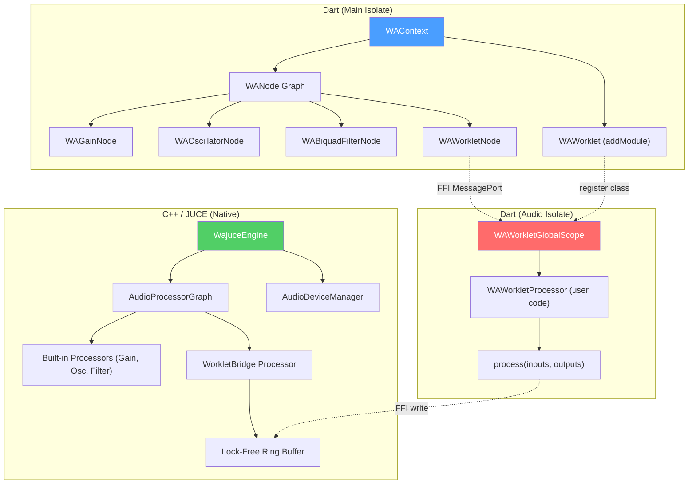
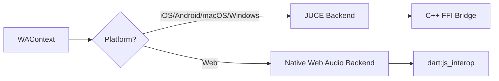
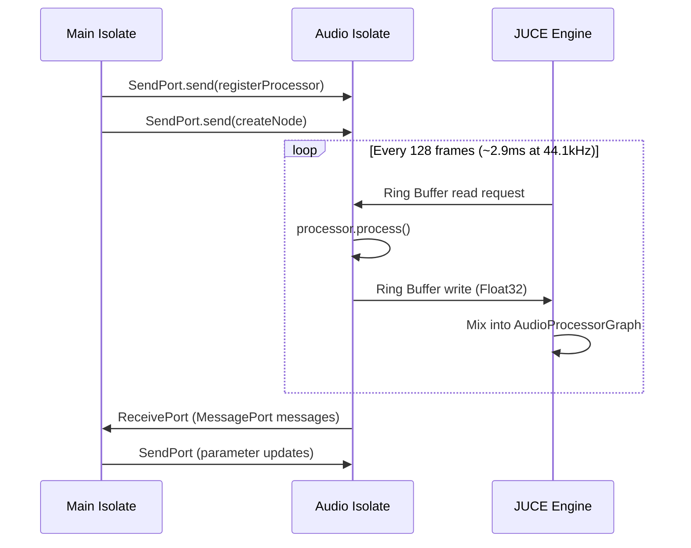

# wajuce: JUCE-powered Web Audio API for Flutter

JUCE Framework를 백엔드로 사용하여, Web Audio API 1.1 호환 인터페이스를 Flutter/Dart에서 제공하는 패키지. 기존 웹 기반 오디오 엔진 코드를 **최소한의 수정**으로 재사용 가능하게 하는 것이 목표.

---

## 1. 핵심 설계 원칙

### Web Audio API → Dart API 1:1 매핑

기존 JS 오디오 엔진 코드가 이미 Web Audio API 패턴을 사용하므로, Dart에서 동일한 인터페이스를 제공하면 **포팅이 아니라 번역** 수준이 됨.

```dart
// JS: const ctx = new AudioContext();
final ctx = WAContext();

// JS: const osc = ctx.createOscillator();
final osc = ctx.createOscillator();

// JS: osc.connect(ctx.destination);
osc.connect(ctx.destination);
```

> [!IMPORTANT]
> 대부분의 고성능 웹 오디오 프로젝트는 **AudioWorklet의 `process()` 메서드** 안에서 DSP를 수행함.
> 따라서 `WAWorkletProcessor` 구현이 wajuce의 **가장 중요한 핵심**.

---

## 2. 아키텍처 개요



### 레이어 구조

| Layer | 역할 | 기술 |
| :--- | :--- | :--- |
| **Dart API** | Web Audio 호환 인터페이스 | Pure Dart |
| **Audio Isolate** | `AudioWorkletGlobalScope` 에뮬레이션 | Dart Isolate + FFI |
| **Native Bridge** | C-API exports (FFI) | C++ / JUCE |
| **JUCE Engine** | 실제 오디오 처리 | `AudioProcessorGraph` + `AudioDeviceManager` |

---

## 3. 대상 플랫폼 & 백엔드 전략

| 플랫폼 | 백엔드 | 설명 |
| :--- | :--- | :--- |
| **iOS** | JUCE (C++ FFI) | `AudioProcessorGraph` + `AudioDeviceManager` |
| **Android** | JUCE (C++ FFI) | 동일 |
| **macOS** | JUCE (C++ FFI) | 동일 |
| **Windows** | JUCE (C++ FFI) | 동일. JUCE가 WASAPI/ASIO 지원 |
| **Web** | **Native Web Audio API** | JUCE 불필요. `dart:js_interop`으로 브라우저 Web Audio 직접 호출 |

> [!IMPORTANT]
> Web 플랫폼은 브라우저에 이미 Web Audio API가 있으므로 JUCE를 사용하지 않음.
> Dart API 인터페이스만 동일하게 유지하고, 내부 구현을 `dart:js_interop`으로 네이티브 Web Audio에 위임.

### 플랫폼별 구현 분기



이를 위해 `lib/src/backend/` 디렉토리에 플랫폼별 구현을 분리:
- `backend_juce.dart` — iOS/Android/macOS/Windows (FFI)
- `backend_web.dart` — Web (`dart:js_interop`)
- `backend.dart` — 공통 인터페이스 (conditional import)

---

## 4. Web Audio 1.1 전체 스펙 Coverage

### 4.1 Node Coverage

| # | Web Audio Node | wajuce 클래스 | 구현 | 우선순위 | 비고 |
| :--- | :--- | :--- | :---: | :---: | :--- |
| 1.1 | `BaseAudioContext` | `WAContext` (base) | ✅ | P1 | |
| 1.2 | `AudioContext` | `WAContext` | ✅ | P1 | |
| 1.3 | `OfflineAudioContext` | `WAOfflineContext` | ✅ | **P1** | 테스트/검증에 필수 |
| 1.4 | `AudioBuffer` | `WABuffer` | ✅ | P1 | |
| 1.5 | `AudioNode` | `WANode` | ✅ | P1 | base class |
| 1.6 | `AudioParam` | `WAParam` | ✅ | P1 | 아래 상세 |
| 1.7 | `AudioScheduledSourceNode` | `WAScheduledSourceNode` | ✅ | P1 | base class |
| 1.8 | `AnalyserNode` | `WAAnalyserNode` | ✅ | P2 | FFT |
| 1.9 | `AudioBufferSourceNode` | `WABufferSourceNode` | ✅ | P1 | 샘플 재생 |
| 1.10 | `AudioDestinationNode` | `WADestinationNode` | ✅ | P1 | |
| 1.11 | `AudioListener` | `WAListener` | 🔲 | P4 | 3D 공간 오디오 |
| 1.12 | ~~`AudioProcessingEvent`~~ | — | ❌ | — | **DEPRECATED** |
| 1.13 | `BiquadFilterNode` | `WABiquadFilterNode` | ✅ | P1 | LP/HP/BP/... |
| 1.14 | `ChannelMergerNode` | `WAChannelMergerNode` | 🔲 | P3 | 채널 합치기 |
| 1.15 | `ChannelSplitterNode` | `WAChannelSplitterNode` | 🔲 | P3 | 채널 분리 |
| 1.16 | `ConstantSourceNode` | `WAConstantSourceNode` | 🔲 | P3 | DC offset |
| 1.17 | `ConvolverNode` | `WAConvolverNode` | 🔲 | P3 | IR 리버브 |
| 1.18 | `DelayNode` | `WADelayNode` | ✅ | P1 | |
| 1.19 | `DynamicsCompressorNode` | `WADynamicsCompressorNode` | ✅ | P1 | |
| 1.20 | `GainNode` | `WAGainNode` | ✅ | P1 | |
| 1.21 | `IIRFilterNode` | `WAIIRFilterNode` | 🔲 | P3 | Custom filter |
| 1.22 | `MediaElementAudioSourceNode` | — | ❌ | — | 모바일 N/A |
| 1.23 | `MediaStreamAudioDestinationNode` | `WAMediaStreamDestNode` | ✅ | **P2** | 녹음 출력 (Sampler 필수) |
| 1.24 | `MediaStreamAudioSourceNode` | `WAMediaStreamSourceNode` | ✅ | **P2** | 마이크/외부 입력 (Sampler 필수) |
| 1.25 | `MediaStreamTrackAudioSourceNode` | `WAMediaStreamTrackSourceNode` | 🔲 | P3 | 트랙 단위 |
| 1.26 | `OscillatorNode` | `WAOscillatorNode` | ✅ | P1 | |
| 1.27 | `PannerNode` | `WAPannerNode` | 🔲 | P3 | 3D panning |
| 1.28 | `PeriodicWave` | `WAPeriodicWave` | ✅ | P3 | 커스텀 파형 |
| 1.29 | ~~`ScriptProcessorNode`~~ | — | ❌ | — | **DEPRECATED** |
| 1.30 | `StereoPannerNode` | `WAStereoPannerNode` | ✅ | **P1** | L/R panning (기본 기능) |
| 1.31 | `WaveShaperNode` | `WAWaveShaperNode` | ✅ | P2 | 디스토션/새추레이션 |
| 1.32 | `AudioWorklet` | `WAWorklet` | ✅ | P1 | ⭐ 핵심 |

범례: ✅ = 포함 (본 계획), 🔲 = 향후 구현, ❌ = 미지원 (deprecated/N/A)

### 4.2 AudioParam 전체 메서드

| 메서드/속성 | 구현 | 설명 |
| :--- | :---: | :--- |
| `value` (getter/setter) | ✅ P1 | 즉시 값 변경 |
| `defaultValue` (readonly) | ✅ P1 | 파라미터 기본값 |
| `minValue` (readonly) | ✅ P1 | 최소 허용값 |
| `maxValue` (readonly) | ✅ P1 | 최대 허용값 |
| `automationRate` (`a-rate`/`k-rate`) | ✅ P2 | per-sample vs per-block |
| `setValueAtTime(value, time)` | ✅ P1 | 특정 시간에 값 설정 |
| `linearRampToValueAtTime(value, time)` | ✅ P1 | 선형 보간 |
| `exponentialRampToValueAtTime(value, time)` | ✅ P1 | 지수 보간 |
| `setTargetAtTime(target, startTime, timeConstant)` | ✅ P1 | RC 감쇠 곡선 |
| `setValueCurveAtTime(values, startTime, duration)` | ✅ P2 | 커스텀 커브 (Float32 배열) |
| `cancelScheduledValues(startTime)` | ✅ P1 | 예약 취소 |
| `cancelAndHoldAtTime(cancelTime)` | ✅ P2 | 취소 후 현재값 유지 |

### 4.3 MIDI IN/OUT

Web Audio 스펙 외 영역이지만, 실제 음악 앱에서 필수. [Web MIDI API](https://www.w3.org/TR/webmidi/) 패턴을 참고하되 wajuce 자체적으로 구현.

| 기능 | Dart API | Native (JUCE) | Web |
| :--- | :--- | :--- | :--- |
| MIDI Input 열거 | `WAMidi.inputs` → `List<WAMidiPort>` | `juce::MidiInput::getAvailableDevices()` | `navigator.requestMIDIAccess()` |
| MIDI Output 열거 | `WAMidi.outputs` → `List<WAMidiPort>` | `juce::MidiOutput::getAvailableDevices()` | `MIDIAccess.outputs` |
| MIDI Input 열기 | `port.open()` → `Stream<WAMidiMessage>` | `MidiInput::openDevice()` + callback | `MIDIInput.onmidimessage` |
| MIDI Output 보내기 | `port.send(WAMidiMessage)` | `MidiOutput::sendMessageNow()` | `MIDIOutput.send()` |
| MIDI Message 파싱 | `WAMidiMessage(status, data1, data2)` | JUCE `MidiMessage` 클래스 활용 | Raw Uint8Array |

```dart
// 사용 예시
final midi = WAMidi();
final inputs = await midi.inputs;
final keyboard = inputs.firstWhere((p) => p.name.contains('DX7'));

keyboard.onMessage.listen((msg) {
  if (msg.isNoteOn) dx7Node.port.postMessage({'type': 'noteOn', 'data': msg});
});
```

> [!IMPORTANT]
> MIDI 통합 및 SysEx 통신이 필요한 복잡한 오디오 애플리케이션들을 위해 MIDI API 지원이 필수.
> 기존 프로젝트들의 MIDI 핸들러를 wajuce의 `WAMidi` API로 쉽게 포팅 가능해야 함.

### 4.4 멀티 IN/OUT 오디오 인터페이스

프로 오디오 장비의 멀티채널 I/O 지원.

| 기능 | Dart API | Native (JUCE) | Web |
| :--- | :--- | :--- | :--- |
| 디바이스 열거 | `WAContext.enumerateDevices()` | `AudioDeviceManager::getAvailableDeviceTypes()` | `navigator.mediaDevices.enumerateDevices()` |
| 입력 채널 수 설정 | `WAContext(inputChannels: N)` | `AudioDeviceManager::setAudioDeviceSetup()` | `AudioContext({sinkId})` |
| 출력 채널 수 설정 | `WAContext(outputChannels: N)` | 동일 | `AudioWorkletNode({outputChannelCount})` |
| 디바이스 선택 | `WAContext(deviceId: id)` | `AudioDeviceManager::setCurrentAudioDeviceType()` | MediaStream constraints |
| I/O 라우팅 | `ChannelSplitter`/`ChannelMerger` 조합 | `AudioProcessorGraph` 채널 매핑 | Web Audio channel routing |

```dart
// 멀티 채널 사용 예시 (4-out 인터페이스)
final ctx = WAContext(outputChannels: 4);
final splitter = ctx.createChannelSplitter(4);

masterBus.connect(splitter);
splitter.connect(ctx.destination, outputIndex: 0); // ch 1-2: main
splitter.connect(fxSend, outputIndex: 2);           // ch 3-4: headphone cue
```

---

## 5. Proposed Changes

---

### Component 1: Dart API Layer (`lib/`)

Web Audio API 1.1 스펙을 Dart로 구현. 기존 JS 코드에서 사용하는 모든 노드/메서드를 지원.

#### [NEW] `lib/wajuce.dart`
패키지 진입점. 모든 public API를 re-export.

#### [NEW] `lib/src/context.dart`
`WAContext` 클래스:
- `createOscillator()`, `createGain()`, `createBiquadFilter()`, `createDynamicsCompressor()`
- `createAnalyser()`, `createDelay()`, `createBuffer()`, `createBufferSource()`
- `decodeAudioData(Uint8List)` → `Future<WABuffer>`
- `destination` (output node)
- `currentTime` (JUCE 타이머 기반)
- `sampleRate`
- `audioWorklet` → `WAWorklet` 인스턴스
- `resume()`, `suspend()`, `close()`
- `state` (`suspended`, `running`, `closed`)

#### [NEW] `lib/src/nodes/`
P1 Core 노드 구현:

| File | Class | Web Audio 원본 |
| :--- | :--- | :--- |
| `audio_node.dart` | `WANode` (base) | `AudioNode` |
| `audio_param.dart` | `WAParam` | `AudioParam` |
| `gain_node.dart` | `WAGainNode` | `GainNode` |
| `oscillator_node.dart` | `WAOscillatorNode` | `OscillatorNode` |
| `biquad_filter_node.dart` | `WABiquadFilterNode` | `BiquadFilterNode` |
| `dynamics_compressor_node.dart` | `WADynamicsCompressorNode` | `DynamicsCompressorNode` |
| `analyser_node.dart` | `WAAnalyserNode` | `AnalyserNode` |
| `delay_node.dart` | `WADelayNode` | `DelayNode` |
| `buffer_source_node.dart` | `WABufferSourceNode` | `AudioBufferSourceNode` |
| `stereo_panner_node.dart` | `WAStereoPannerNode` | `StereoPannerNode` |
| `wave_shaper_node.dart` | `WAWaveShaperNode` | `WaveShaperNode` |

P3 확장 노드 (후속 구현):

| File | Class | Web Audio 원본 |
| :--- | :--- | :--- |
| `channel_merger_node.dart` | `WAChannelMergerNode` | `ChannelMergerNode` |
| `channel_splitter_node.dart` | `WAChannelSplitterNode` | `ChannelSplitterNode` |
| `constant_source_node.dart` | `WAConstantSourceNode` | `ConstantSourceNode` |
| `convolver_node.dart` | `WAConvolverNode` | `ConvolverNode` |
| `iir_filter_node.dart` | `WAIIRFilterNode` | `IIRFilterNode` |
| `panner_node.dart` | `WAPannerNode` | `PannerNode` |
| `periodic_wave.dart` | `WAPeriodicWave` | `PeriodicWave` |

#### [NEW] `lib/src/audio_param.dart`
`WAParam` 클래스 — **AudioParam 자동화 전체 구현**:

**Properties:**
- `value` (getter/setter) — 즉시 값 변경
- `defaultValue` (readonly) — 노드 생성 시 기본값
- `minValue` (readonly) — 허용 최소값 (기본: `-3.4028235e38`)
- `maxValue` (readonly) — 허용 최대값 (기본: `3.4028235e38`)
- `automationRate` — `AutomationRate.aRate` (per-sample) 또는 `AutomationRate.kRate` (per-block)

**Automation Methods (P1):**
- `setValueAtTime(value, time)`
- `linearRampToValueAtTime(value, time)`
- `exponentialRampToValueAtTime(value, time)`
- `setTargetAtTime(target, startTime, timeConstant)`
- `cancelScheduledValues(startTime)`

**Automation Methods (P2):**
- `setValueCurveAtTime(Float32List values, startTime, duration)` — 커스텀 자동화 커브
- `cancelAndHoldAtTime(cancelTime)` — 취소 후 현재 보간값 유지

> [!IMPORTANT]
> `setValueAtTime()` 및 `exponentialRampToValueAtTime()`과 같은 자동화가 정확하지 않으면 정밀한 음색 재현이 불가능함.

#### [NEW] `lib/src/worklet/`
AudioWorklet 에뮬레이션 — **가장 중요한 컴포넌트**:

| File | Class | 역할 |
| :--- | :--- | :--- |
| `wa_worklet.dart` | `WAWorklet` | `audioWorklet.addModule()` 에뮬레이션 |
| `wa_worklet_node.dart` | `WAWorkletNode` | Main Isolate 측 인터페이스 |
| `wa_worklet_processor.dart` | `WAWorkletProcessor` | 유저가 상속하는 베이스 클래스 |
| `wa_worklet_global_scope.dart` | `WAWorkletGlobalScope` | Audio Isolate 내 실행 환경 |
| `message_port.dart` | `WAMessagePort` | Main ↔ Audio Isolate 통신 |

---

### Component 2: Audio Isolate (`lib/src/isolate/`)

Web Audio의 AudioWorklet 스레드를 Dart Isolate로 에뮬레이션.

#### [NEW] `lib/src/isolate/audio_isolate.dart`
- 고우선순위 Isolate 생성 및 관리
- `WAWorkletProcessor` 서브클래스 인스턴스화
- 128-frame quantum 단위로 `process()` 호출
- `SendPort`/`ReceivePort` 기반 MessagePort 에뮬레이션

#### [NEW] `lib/src/isolate/ring_buffer.dart`
- Lock-Free SPSC Ring Buffer (FFI 매핑)
- Audio Isolate → Native 방향 오디오 데이터 전송
- `Float32List` 기반 zero-copy 가능

---

### Component 3: Native Bridge (`native/`)

JUCE Framework를 C-API로 노출.

#### [NEW] `native/src/wajuce_bridge.h`
```c
// Context Management
EXPORT int wajuce_context_create(int sample_rate, int buffer_size);
EXPORT void wajuce_context_destroy(int ctx_id);
EXPORT double wajuce_context_get_time(int ctx_id);

// Node Factory
EXPORT int wajuce_create_gain(int ctx_id);
EXPORT int wajuce_create_oscillator(int ctx_id);
EXPORT int wajuce_create_biquad_filter(int ctx_id);
EXPORT int wajuce_create_compressor(int ctx_id);
EXPORT int wajuce_create_analyser(int ctx_id);
EXPORT int wajuce_create_delay(int ctx_id, float max_delay);
EXPORT int wajuce_create_buffer_source(int ctx_id);

// Graph Topology
EXPORT void wajuce_connect(int ctx_id, int src_id, int dst_id);
EXPORT void wajuce_disconnect(int ctx_id, int src_id, int dst_id);

// Parameter Automation
EXPORT void wajuce_param_set(int node_id, const char* param, float value);
EXPORT void wajuce_param_set_at_time(int node_id, const char* param, float value, double time);
EXPORT void wajuce_param_linear_ramp(int node_id, const char* param, float value, double time);
EXPORT void wajuce_param_exp_ramp(int node_id, const char* param, float value, double time);
EXPORT void wajuce_param_set_target(int node_id, const char* param, float target, double start, float tc);

// Worklet Bridge
EXPORT int wajuce_create_worklet_bridge(int ctx_id, int num_inputs, int num_outputs);
EXPORT void* wajuce_get_ring_buffer_ptr(int bridge_id);

// Oscillator
EXPORT void wajuce_osc_set_type(int node_id, int type); // 0=sine,1=square,2=saw,3=triangle
EXPORT void wajuce_osc_start(int node_id, double time);
EXPORT void wajuce_osc_stop(int node_id, double time);

// BiquadFilter
EXPORT void wajuce_filter_set_type(int node_id, int type); // 0=LP,1=HP,2=BP...

// BufferSource
EXPORT void wajuce_buffer_source_set_buffer(int node_id, const float* data, int frames, int channels, int sr);
EXPORT void wajuce_buffer_source_start(int node_id, double time);

// Analyser
EXPORT void wajuce_analyser_get_byte_freq(int node_id, uint8_t* data, int len);
EXPORT void wajuce_analyser_get_byte_time(int node_id, uint8_t* data, int len);
```

#### [NEW] `native/src/wajuce_engine.cpp`
- `juce::AudioProcessorGraph` 기반 그래프 관리
- `juce::AudioDeviceManager` 기반 하드웨어 추상화
- 각 노드를 `AudioProcessor` 서브클래스로 구현

#### [NEW] `native/src/processors/`
JUCE `AudioProcessor` 구현체:

| File | JUCE Class | Web Audio 대응 |
| :--- | :--- | :--- |
| `gain_processor.cpp` | `GainProcessor` | `GainNode` |
| `oscillator_processor.cpp` | `OscillatorProcessor` | `OscillatorNode` |
| `biquad_processor.cpp` | `BiquadProcessor` | `BiquadFilterNode` |
| `compressor_processor.cpp` | `CompressorProcessor` | `DynamicsCompressorNode` |
| `analyser_processor.cpp` | `AnalyserProcessor` | `AnalyserNode` |
| `delay_processor.cpp` | `DelayProcessor` | `DelayNode` |
| `buffer_source_processor.cpp` | `BufferSourceProcessor` | `AudioBufferSourceNode` |
| `worklet_bridge_processor.cpp` | `WorkletBridgeProcessor` | AudioWorklet consumer |

#### [NEW] `native/CMakeLists.txt`
JUCE 빌드 설정. 의존 모듈:
- `juce_audio_basics`, `juce_audio_devices`, `juce_audio_formats`
- `juce_audio_processors`, `juce_core`, `juce_dsp`

---

### Component 4: FFI Bindings (`lib/src/ffi/`)

#### [NEW] `lib/src/ffi/wajuce_bindings.dart`
`dart:ffi`를 사용한 C-API 바인딩. `ffigen` 또는 수동 작성.

#### [NEW] `lib/src/ffi/native_library.dart`
플랫폼별 동적 라이브러리 로딩 (`DynamicLibrary.open`).

---

### Component 5: Web Backend (`lib/src/backend/`)

Web 플랫폼 전용. 브라우저 네이티브 Web Audio API를 `dart:js_interop`으로 직접 호출.

#### [NEW] `lib/src/backend/backend.dart`
공통 인터페이스 정의 + conditional import:
```dart
export 'backend_stub.dart'
    if (dart.library.ffi) 'backend_juce.dart'
    if (dart.library.js_interop) 'backend_web.dart';
```

#### [NEW] `lib/src/backend/backend_juce.dart`
FFI 기반 JUCE 백엔드 (iOS/Android/macOS/Windows).

#### [NEW] `lib/src/backend/backend_web.dart`
`dart:js_interop` 기반 Web Audio 패스스루:
- `WAContext` → `window.AudioContext`
- `WAGainNode` → `AudioContext.createGain()`
- `WAWorkletNode` → `AudioWorkletNode`
- 모든 호출을 브라우저 네이티브에 1:1 위임

> [!TIP]
> Web 백엔드는 사실상 JS interop 래퍼. JUCE 코드 불필요.
> 기존의 JS AudioWorklet 코드를 **그대로** 사용 가능.

---

## 4. 기존 프로젝트 포팅 가이드

### AM → Flutter (wajuce 사용)

```dart
// 기존 JS: const ctx = new AudioContext();
// 기존 JS: const master = ctx.createDynamicsCompressor();
// 기존 JS: const osc = ctx.createOscillator(); osc.type = 'sawtooth';
// 기존 JS: const filter = ctx.createBiquadFilter(); filter.type = 'lowpass';

final ctx = WAContext();
await ctx.resume();

final master = ctx.createDynamicsCompressor();
master.threshold.value = -8;
master.ratio.value = 12;

final analyser = ctx.createAnalyser();
analyser.fftSize = 2048;

master.connect(analyser);
analyser.connect(ctx.destination);

// TB303 포팅
final osc = ctx.createOscillator();
osc.type = WAOscillatorType.sawtooth;
final filter = ctx.createBiquadFilter();
filter.type = WABiquadFilterType.lowpass;
final gain = ctx.createGain();

osc.connect(filter);
filter.connect(gain);
gain.connect(master);

// AudioParam 자동화 (TB303 envelope)
filter.frequency.setValueAtTime(cutoff, time);
filter.frequency.exponentialRampToValueAtTime(targetFreq, time + decay);
```

### FM → Flutter (wajuce 사용)

```dart
// FM Synthesis는 AudioWorklet으로 포팅
await ctx.audioWorklet.addModule('dx7_processor');

final dx7Node = WAWorkletNode(ctx, 'dx7-processor');
dx7Node.connect(ctx.destination);

// SysEx 데이터 전송
dx7Node.port.postMessage({'type': 'patch', 'data': patchData});
dx7Node.port.postMessage({'type': 'noteOn', 'data': {'note': 60, 'velocity': 0.8}});
```

### Sampler → Flutter (wajuce 사용)

```dart
// Sampler도 AudioWorklet으로 포팅
await ctx.audioWorklet.addModule('voice_processor');

final samplerNode = WAWorkletNode(ctx, 'voice-processor');
samplerNode.connect(ctx.destination);

// 샘플 로드
final buffer = await ctx.decodeAudioData(wavBytes);
samplerNode.port.postMessage({
  'type': 'ADD_SAMPLE',
  'data': {'id': 'kick', 'channels': [buffer.getChannelData(0)]}
});

// 트리거
samplerNode.port.postMessage({
  'type': 'TRIGGER_PAD',
  'data': {'padId': 'pad1', 'sampleId': 'kick', ...}
});
```

---

## 5. Worker (AudioWorklet) 구현 상세

### 두 가지 모드

#### Mode A: Dart DSP
`process()` 안에서 직접 오디오 데이터를 생성. Dart Isolate에서 실행.

```dart
class DX7Processor extends WAWorkletProcessor {
  @override
  bool process(List<Float32List> inputs, List<Float32List> outputs) {
    final outL = outputs[0];
    final outR = outputs[1];
    for (int i = 0; i < outL.length; i++) {
      // FM synthesis here...
      outL[i] = sample;
      outR[i] = sample;
    }
    return true;
  }
}
```

#### Mode B: JUCE Node Graph
`OscillatorNode`, `BiquadFilterNode` 등 JUCE 내장 프로세서를 그래프로 연결.
Worklet은 Clock/Sequencer 역할만.

```dart
class ClockProcessor extends WAWorkletProcessor {
  @override
  bool process(List<Float32List> inputs, List<Float32List> outputs) {
    // No audio processing, just timing
    if (isPlaying && nextNoteTime < currentTime + lookahead) {
      port.postMessage({'type': 'tick', 'time': nextNoteTime, 'step': currentStep});
      // advance step...
    }
    return true;
  }
}
```

### Isolate ↔ Native 데이터 플로우



---

## 6. 패키지 구조

```
wajuce/
├── lib/
│   ├── wajuce.dart                    # Public API
│   └── src/
│       ├── context.dart               # WAContext
│       ├── audio_param.dart           # WAParam (automation)
│       ├── nodes/
│       │   ├── audio_node.dart        # WANode base
│       │   ├── gain_node.dart
│       │   ├── oscillator_node.dart
│       │   ├── biquad_filter_node.dart
│       │   ├── dynamics_compressor_node.dart
│       │   ├── analyser_node.dart
│       │   ├── delay_node.dart
│       │   └── buffer_source_node.dart
│       ├── worklet/
│       │   ├── wa_worklet.dart
│       │   ├── wa_worklet_node.dart
│       │   ├── wa_worklet_processor.dart
│       │   ├── wa_worklet_global_scope.dart
│       │   └── message_port.dart
│       ├── isolate/
│       │   ├── audio_isolate.dart
│       │   └── ring_buffer.dart
│       └── ffi/
│           ├── wajuce_bindings.dart
│           └── native_library.dart
├── native/
│   ├── CMakeLists.txt
│   ├── vendor/JUCE/                   # JUCE submodule
│   └── src/
│       ├── wajuce_bridge.h
│       ├── wajuce_engine.cpp
│       └── processors/
│           ├── gain_processor.cpp
│           ├── oscillator_processor.cpp
│           ├── biquad_processor.cpp
│           ├── compressor_processor.cpp
│           ├── analyser_processor.cpp
│           ├── delay_processor.cpp
│           ├── buffer_source_processor.cpp
│           └── worklet_bridge_processor.cpp
├── ios/
│   └── wajuce.podspec
├── android/
│   └── CMakeLists.txt
├── macos/
│   └── wajuce.podspec
├── windows/
│   └── CMakeLists.txt
├── web/                                # No native code needed
├── test/
│   └── wajuce_test.dart
├── example/
│   ├── lib/
│   │   ├── main.dart
│   │   └── examples/
│   │       ├── sine_wave.dart         # 기본 Oscillator 테스트
│   │       ├── complex_synth_example.dart # 복합 신디사이저 포팅 예제
│   │       └── fm_synth_example.dart  # FM 엔진 포팅 예제
│   └── pubspec.yaml
└── pubspec.yaml
```

---

## 7. 구현 우선순위 (Phase)

### Phase 1: Foundation (1-2주)
- [x] 프로젝트 스캐폴딩 (Flutter Plugin, CMake, JUCE 서브모듈)
- [x] `WAContext`, `WAOfflineContext`, `WANode` base, `connect()`/`disconnect()`
- [x] `WAGainNode`, `WAStereoPannerNode` (기본 프로세서)
- [x] Native Bridge 기본 CRC (create/connect/destroy)
- [x] FFI 바인딩 생성
- [x] **검증**: Gain → StereoPanner → Destination 연결 후 테스트 톤 L/R 출력

### Phase 2: Core Nodes (1-2주)
- [x] `WAOscillatorNode` (sine, square, sawtooth, triangle)
- [x] `WABiquadFilterNode` (lowpass, highpass, bandpass)
- [x] `WAParam` 자동화 (전체 12 메서드 구현)
- [x] `WADynamicsCompressorNode`
- [x] `WADelayNode`
- [x] `WAAnalyserNode` (FFT 데이터)
- [x] **검증**: Oscillator → Filter → Gain → Destination 체인으로 복합 음색 재현

### Phase 3: AudioWorklet (2-3주) ⭐ **핵심**
- [x] Audio Isolate 생성 및 관리
- [x] `WAWorkletProcessor` base class
- [x] `WAWorkletNode` + MessagePort (SendPort/ReceivePort)
- [x] `registerProcessor()` 메커니즘
- [ ] Lock-Free Ring Buffer (Dart ↔ C++)
- [x] 128-frame quantum 처리 루프
- [x] **Bug Fix**: Multi-node message routing (Sequencer fix)
- [x] **검증**: ClockProcessor 포팅 → 정확한 16th-note 타이밍 검증

### Phase 4: Buffer, Sample & I/O (1-2주) ✅
- [x] `WABuffer` (AudioBuffer 에뮬레이션)
- [x] `WABufferSourceNode`, `decodeAudioData()`
- [x] `WAMediaStreamSourceNode` (마이크/외부 입력)
- [x] `WAMediaStreamDestNode` (녹음 출력)
- [x] **검증**: `example/main.dart`에 "I/O & Recording" 탭 추가
  - [x] Microphone Input -> Analyser (FFT Monitor) -> Destination 구현
  - [x] `decodeAudioData`를 통한 오디오 파일 로드 및 재생 검증

### Phase 5: MIDI (1주) ✅
- [x] `WAMidi` — 디바이스 열거, 열기/닫기
- [x] `WAMidiPort` — Input Stream, Output send
- [x] `WAMidiMessage` — Note/CC/SysEx 파싱
- [x] **검증**: MIDI 장치 연결 및 성능 확인

### Phase 6: Multi-Channel I/O & Platform (1주)
- [ ] 멀티채널 오디오 디바이스 설정 (4+ ch output)
- [ ] `ChannelSplitter`/`ChannelMerger` 노드
- [x] Web 백엔드 (`backend_web.dart`) 구현
- [ ] Windows 빌드 검증
- [ ] **검증**: 4-out 인터페이스에서 채널별 라우팅 확인

### Phase 7: Integration & Examples (1주)
- [ ] 고성능 오디오 합성 포팅 예제
- [ ] MIDI 및 SysEx 연동 예제
- [ ] 샘플링 및 녹음 연동 예제
- [ ] Web 빌드 확인 (네이티브 Web Audio 패스스루)
- [ ] 문서화 및 API reference

---

## 8. Verification Plan

### Automated Tests
```bash
# Unit tests
flutter test

# Integration test on iOS simulator
flutter test integration_test/sine_wave_test.dart
```

### Key Test Cases
1. **Sine Wave Output**: `WAOscillatorNode` → `WAGainNode` → `destination`으로 440Hz 사인파 출력
2. **Filter Sweep**: `WABiquadFilterNode` cutoff 파라미터에 `exponentialRampToValueAtTime` 적용 후 스펙트럼 검증
3. **OfflineAudioContext**: `WAOfflineContext`로 1초 렌더링 후 WAV 출력 검증
4. **Clock Accuracy**: `WAWorkletProcessor` 기반 클럭의 tick 간격이 BPM 기반 예상값과 ±1ms 이내
5. **Ring Buffer Integrity**: Audio Isolate에서 생성한 데이터가 JUCE 출력에서 glitch 없이 재생
6. **16-voice Polyphony**: 복합 신디사이저 엔진에서 16개 동시 Voice가 audio underrun 없이 처리
7. **MIDI Round-Trip**: MIDI 입력 → Processor → 오디오 출력까지 <5ms 레이턴시
8. **Mic Input**: `WAMediaStreamSourceNode` → `WAGainNode` → 녹음/모니터링
9. **Multi-Channel**: 4+ 채널 출력에서 독립적 라우팅 확인
10. **Web Parity**: 웹 빌드에서 동일한 Dart 코드가 네이티브 Web Audio로 실행 확인

### Manual Verification
- iOS 실기기에서 오디오 엔진 포팅 예제 실행 → 웹 버전과 A/B 비교
- latency 측정 (목표: \<10ms round-trip)
- MIDI 장치 연결 후 연주 및 제어 테스트
- USB 오디오 인터페이스(4-out)에서 멀티채널 라우팅 확인
- Chrome에서 Web 빌드 실행 → 네이티브 Web Audio DevTools로 그래프 확인
