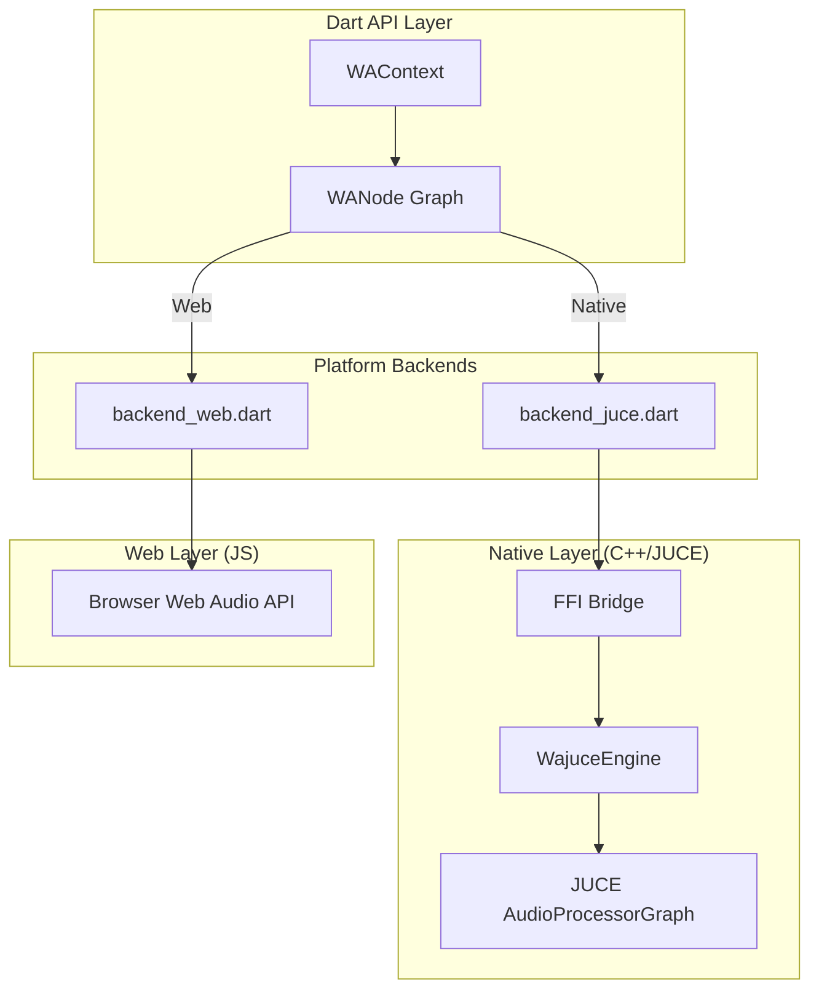

# wajuce

[](https://pub.dev/packages/wajuce)

**JUCE-powered Web Audio API for Flutter.**

`wajuce` provides a Web Audio API 1.1 compatible interface for Flutter and Dart. It allows developers to use familiar Web Audio patterns while delivering high-performance, low-latency audio processing via a native JUCE C++ backend.

---

## 🌟 Key Features

- **Web Audio API Parity**: Mirrors `AudioContext`, `OscillatorNode`, `GainNode`, etc., making it easy to port existing JS audio engines.
- **JUCE Backend**: Leverages the industry-standard JUCE framework for native audio processing on iOS, Android, macOS, and Windows.
- **Pure Web Support**: Automatically falls back to the browser's native Web Audio API on Web platforms via `dart:js_interop`.
- **Zero-Overhead FFI**: Uses Dart FFI for fast communication between Dart and C++ without MethodChannel overhead.
- **AudioWorklet Support**: Native uses high-priority Dart Isolates; Web uses browser AudioWorklet via `dart:js_interop`.
- **Feedback Loops**: Built-in `FeedbackBridge` automatically handles cyclic connections in the node graph (1-block delay).

---

## 🚀 Quick Start (New Flutter App)

```bash
flutter create my_audio_app
cd my_audio_app
flutter pub add wajuce
flutter pub get
```

Use it in code:

```dart
import 'package:wajuce/wajuce.dart';

Future<void> startAudio() async {
  final ctx = WAContext();
  await ctx.resume();

  final osc = ctx.createOscillator();
  final gain = ctx.createGain();
  gain.gain.value = 0.1;

  osc.connect(gain);
  gain.connect(ctx.destination);
  osc.start();
}
```

### Windows Notes

- Building **Android** on Windows requires Android SDK/NDK/CMake and accepted licenses.
- Building a **Windows executable** requires Visual Studio with Desktop C++ workload.

---

## 🤖 Deterministic Agent Install (Cross-Platform)

From this repository root, run installer scripts against your app path:

macOS/Linux:

```bash
dart run tool/install_wajuce.dart --app-root /absolute/path/to/my_audio_app --source pub --target android
dart run tool/verify_wajuce.dart --app-root /absolute/path/to/my_audio_app --target android
```

Windows (PowerShell):

```powershell
dart run tool/install_wajuce.dart --app-root C:\work\my_audio_app --source pub --target windows
dart run tool/verify_wajuce.dart --app-root C:\work\my_audio_app --target windows
```

Path source install (local plugin checkout):

```bash
dart run tool/install_wajuce.dart --app-root /absolute/path/to/my_audio_app --source path --wajuce-path /absolute/path/to/wajuce --target web
dart run tool/verify_wajuce.dart --app-root /absolute/path/to/my_audio_app --source path --wajuce-path /absolute/path/to/wajuce --target web
```

---

## 🏗️ Architecture

`wajuce` is built on a multi-backend architecture that ensures code portability across all platforms:



---

## 🚀 Current Implementation Status (2026-02-14)

| Feature Group | Status | Component Coverage |
| :--- | :---: | :--- |
| **Context & Graph** | ✅ Done | `WAContext`, `WAOfflineContext`, `connect/disconnect` |
| **Context Extras** | ✅ Done | `listener`, `baseLatency`, `outputLatency`, `sinkId`, `getOutputTimestamp()`, `renderCapacity` (minimal wrapper) |
| **Multi-Channel** | ✅ Done | Support up to 32 channels, `ChannelSplitter`, `ChannelMerger` |
| **Core Nodes** | ✅ Done | `Oscillator`, `Gain`, `BiquadFilter`, `Compressor`, `Delay`, `Analyser`, `StereoPanner`, `WaveShaper`, `BufferSource` |
| **Extended Nodes (0.1.5)** | ✅ API Surface | `ConstantSource`, `Convolver`, `IIRFilter`, `Panner`, `MediaElementAudioSource`, `MediaStreamTrackAudioSource` (backend-specific shim/fallback where needed) |
| **AudioParam** | ✅ Done | Full automation (12 methods including `exponentialRampToValueAtTime`) |
| **Deprecated Compatibility** | ✅ Shim | Minimal compatibility for deprecated `ScriptProcessorNode`/`AudioProcessingEvent` |
| **MIDI API** | ✅ Done | Hardware I/O, device enumeration, SysEx support |
| **AudioWorklet** | ✅ Done | Native isolate bridge + Web AudioWorklet passthrough/module loading flow |
| **Web Backend** | ✅ Done | Browser Web Audio passthrough via `js_interop` (pub.dev platform badge may not list Web due plugin metadata) |
| **Build System** | ✅ Done | iOS, Android, macOS, Windows native backends + Web backend path |

---

## ⚡ v0.1.1 Performance & Scalability
The 0.1.1 release introduces significant optimizations for complex node graphs:
- **Native Batch Creation**: Create complex voices (15+ nodes) in a single FFI call, preventing audio thread contention.
- **Lazy Connection**: Voices in the `MachineVoicePool` are kept disconnected until playback, saving substantial CPU.
- **Async Voice Pooling**: Background replenishment of voice pools to ensure glitch-free sequencer tracking.

---

## 🎹 AudioWorklet
Run custom DSP code with a unified module flow (native isolate bridge, Web AudioWorklet):

```dart
// 1. Define processor
class DX7Processor extends WAWorkletProcessor {
  DX7Processor() : super(name: 'dx7');

  @override
  bool process(inputs, outputs, params) {
    // DSP code here...
    return true;
  }
}

// 2. Register & Run
WAWorkletModules.define('dx7', (registrar) {
  registrar.registerProcessor('dx7', () => DX7Processor());
});
await ctx.audioWorklet.addModule('dx7');
final node = ctx.createWorkletNode('dx7');
node.connect(ctx.destination);
```

---

## 💻 Usage Example

The API is designed to be almost identical to the standard Web Audio API:

```dart
// 1. Initialize context
final ctx = WAContext();
await ctx.resume();

// 2. Create nodes
final osc = ctx.createOscillator();
final filter = ctx.createBiquadFilter();
final gain = ctx.createGain();

// 3. Configure and Automate
osc.type = WAOscillatorType.sawtooth;
filter.frequency.setValueAtTime(440, ctx.currentTime);
filter.frequency.exponentialRampToValueAtTime(2000, ctx.currentTime + 2.0);

// 4. Connect graph
osc.connect(filter);
filter.connect(gain);
gain.connect(ctx.destination);

// 5. Start
osc.start();
```

---

## 🛠️ Project Structure

- `lib/src/`: Dart API implementation and backend switching logic.
- `lib/src/backend/`: Platform-specific implementation (FFI vs JS).
- `native/engine/`: The JUCE-based C++ audio engine.
- `src/`: C-API headers and stubs for FFI binding.

---

## 🤖 AI Skills & Automation

This project includes specialized **AI Skills** to help agents maintain the development environment.

- **JUCE Management (`juce_setup`)**: Automated detection and setup of the JUCE framework.
  - Located at: `.agent/skills/juce_management/SKILL.md` (repository checkout context)
  - Purpose: Fixes broken dependencies and configures JUCE submodules.
- **Install scripts**:
  - `tool/install_wajuce.dart`
  - `tool/verify_wajuce.dart`
  - Purpose: deterministic first-time installation and validation for macOS/Linux/Windows.

To use these assets, ask your AI agent:
- "Use `SKILLS.md` and run `tool/install_wajuce.dart` for this app."
- "Then run `tool/verify_wajuce.dart` and report pass/fail checks."

---

## 📄 License

This project is licensed under the MIT License - see the LICENSE file for details.

The native backend links against JUCE. If you distribute products using the
native JUCE runtime, you must also comply with JUCE's license terms:
[JUCE 8 Licence](https://juce.com/legal/juce-8-licence/).
